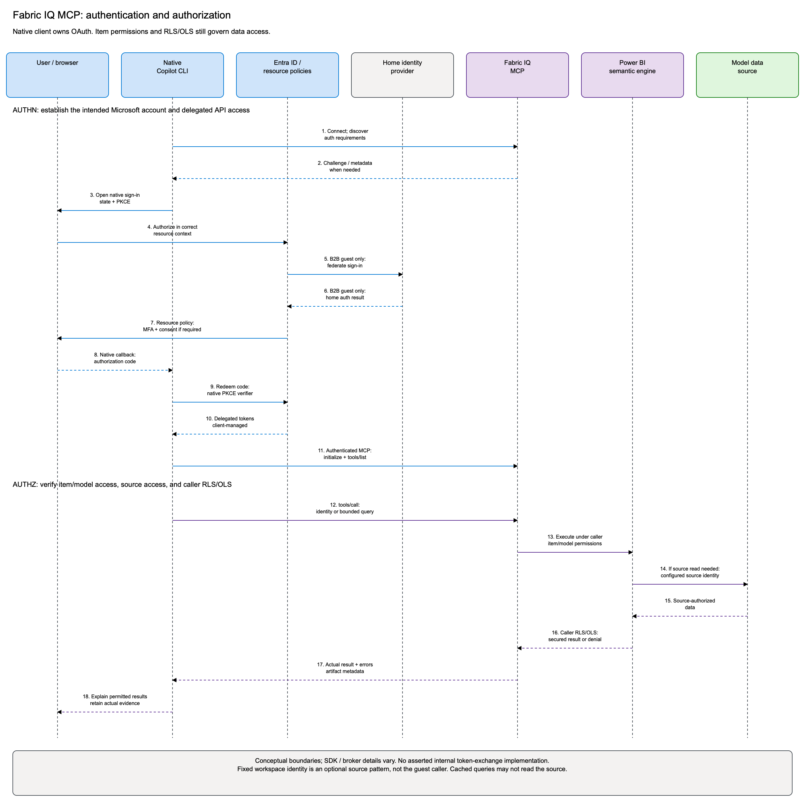

# Authentication and authorization

**Authentication (authn)** establishes who signed in.
**Authorization (authz)** determines which content and data that identity may use.
They are separate checks.



## Sequence diagram

```mermaid
sequenceDiagram
    autonumber
    actor U as User / browser
    participant C as Native Copilot CLI
    participant E as Entra ID / resource policies
    participant H as Home identity provider
    participant M as Fabric IQ MCP
    participant P as Power BI semantic engine
    participant S as Model data source
    Note over U,C: GitHub login is separate; Microsoft OAuth is client-managed
    C->>M: Connect; discover authentication requirements
    M-->>C: Authentication challenge / metadata when needed
    C->>U: Open native sign-in with state and PKCE
    U->>E: Authorize in the correct resource context
    opt B2B guest with external home tenant
        E->>H: Federate authentication to user's home identity
        H-->>E: Home authentication result
    end
    E->>U: Apply resource policies, MFA and consent as required
    U-->>C: Native callback with authorization code
    C->>E: Redeem code using the native PKCE verifier
    E-->>C: Delegated token response managed by the client
    C->>M: Authenticated MCP initialize and tools/list
    C->>M: tools/call: identity or bounded data query
    M->>P: Execute under caller's item/model permissions
    opt Model needs source access
        P->>S: Read using the model's configured source identity
        S-->>P: Source-authorized data
    end
    Note over P,S: Fixed workspace identity is an optional owner-configured pattern, not the guest identity
    P-->>M: Result restricted by caller's RLS/OLS, or denial
    M-->>C: Actual tool result, errors and artifact metadata
    C-->>U: Explain permitted results; retain actual response evidence
```

The diagram describes logical OAuth and authorization boundaries. SDK/broker
details can differ. It does **not** assert a particular internal Fabric
on-behalf-of/token-exchange implementation. Cached data may avoid a source read
on an individual query.

The [standalone Mermaid source](../diagrams/auth-sequence.mmd), rendered SVG,
and editable Excalidraw file are included in [diagram sources](../diagrams/README.md).

## What each boundary checks

| Boundary | Check | Does not prove |
| --- | --- | --- |
| GitHub | Copilot CLI entitlement/login | Microsoft Fabric access |
| Entra authentication | Intended account, tenant context, applicable MFA/CA | Report/model permissions |
| OAuth consent | Client may invoke the delegated APIs | Access to every item in the tenant |
| MCP connection | Authentication, initialization, current tools | Query success on a particular model |
| Item/model authorization | Caller may read the actual report/model | Every requested field/row is visible |
| Power BI RLS/OLS | Allowed row sets and objects for the query caller | Source credentials are configured correctly |
| Source authorization | Configured source identity may read needed data | Guest receives unrestricted query results |

The source identity and query caller must not be conflated. In an
owner-configured fixed-identity Direct Lake model, source access can be
performed by workspace identity while the semantic query remains subject
to the guest's RLS/OLS.

## Tenant member versus guest

For a member in the resource tenant, the external federation branch is
unnecessary. For an accepted B2B guest, the home account authenticates the
person and the resource tenant governs access to hosted content.

Do not assume the client selected the correct guest/resource context because
an OAuth page says success. Prove the current caller with a fresh model query.
`USERPRINCIPALNAME()` may return a home UPN or an owner-approved host guest
alias. It is not a decoded OAuth tenant/object-ID claim.

The browser report session and native MCP session are separate. A browser
report URL's `ctid` selects browser directory context, not a persistent
Copilot OAuth tenant setting.

## Native client owns OAuth

The supported CLI uses a preregistered Microsoft application and handles the
authorization code flow, PKCE, callback, token storage, refresh, and outgoing
authorization itself. Never build these requests manually for this setup.

The Fabric IQ documentation lists delegated `Item.Read.All`,
`Item.Execute.All`, and `Dataset.Read.All` from the Power BI Service API.
Consent can be restricted by tenant policy.

Do not add a bearer header, copy credential files, extract Keychain entries,
or use an administrator/service principal instead of the guest.
Configuration profiles can share OS credentials and browser sessions.

Use the client's supported resource-tenant selection, if available.
If the intended guest cannot authorize in the resource context, stop and
ask the identity administrator or client support to review the failure.
Do not rewrite authorization URLs or invent a persistent tenant setting.
See [resource-tenant checks](../skills/fabric-iq-b2b-validation/references/TROUBLESHOOTING.md#resource-tenant-checks).

## References

- [Fabric IQ MCP authentication and permissions](https://learn.microsoft.com/en-us/fabric/iq/connectors/fabric-iq-mcp)
- [Entra authorization code flow and PKCE](https://learn.microsoft.com/en-us/entra/identity-platform/v2-oauth2-auth-code-flow)
- [Power BI RLS](https://learn.microsoft.com/en-us/fabric/security/service-admin-row-level-security)
- [Power BI OLS](https://learn.microsoft.com/en-us/fabric/security/service-admin-object-level-security)
