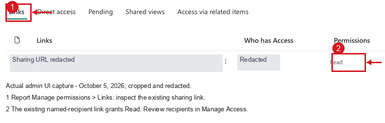
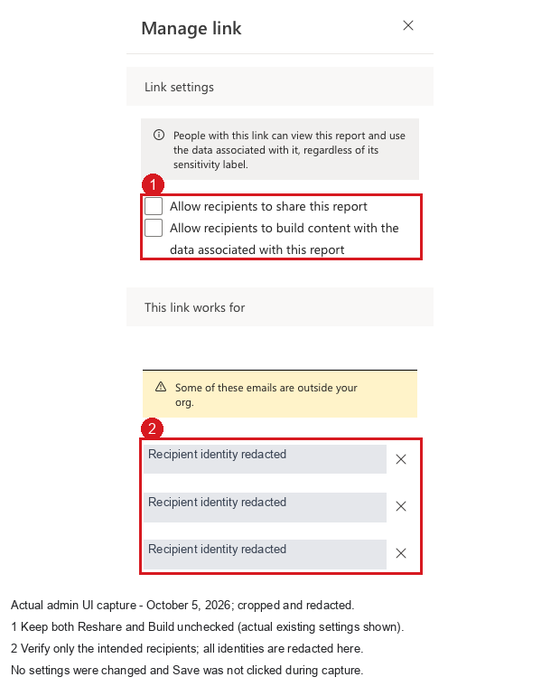
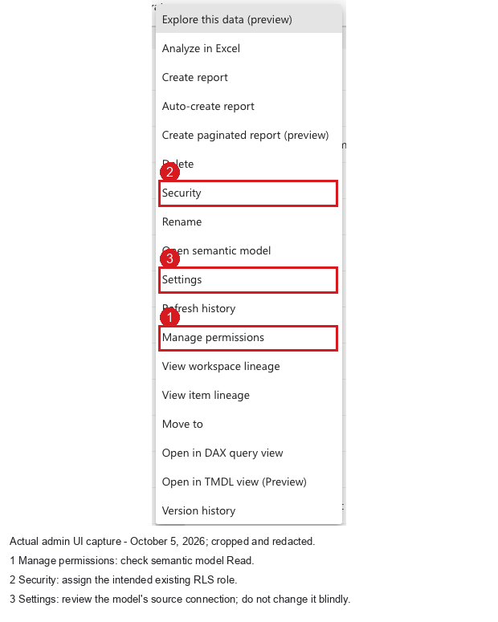
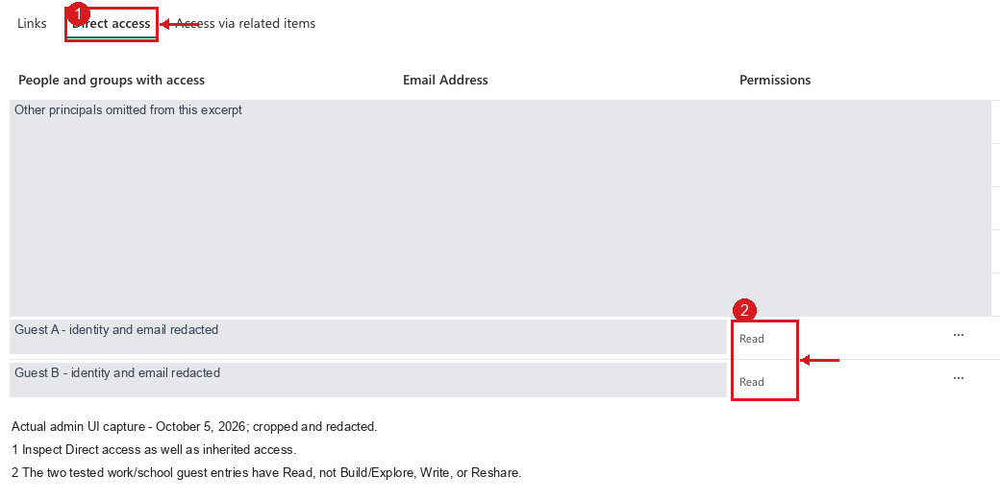
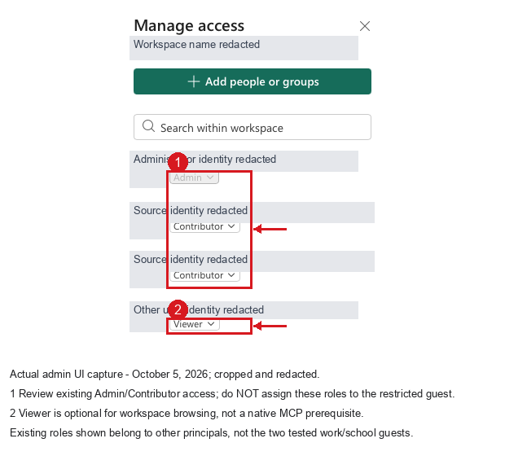
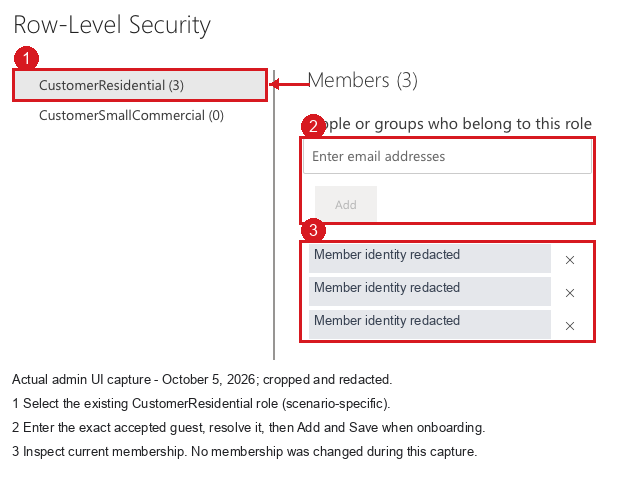
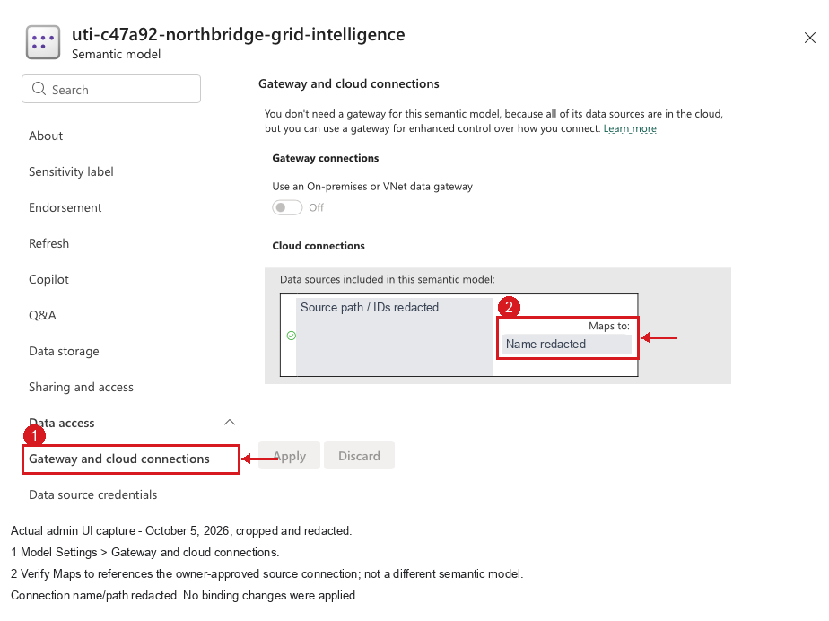
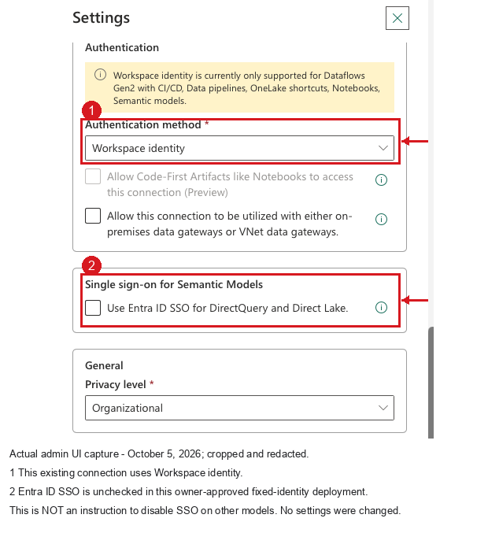

# B2B guest access to Power BI through native Fabric IQ MCP

Use this procedure to onboard an external work/school user. The content
owner prepares access; the guest signs in and verifies it. Replace
placeholders and example model objects with your own environment.

**Outcome:** a named, accepted B2B guest can query the intended semantic model
through GitHub Copilot CLI, with existing RLS/OLS enforced. Browser report
viewing is a separate acceptance check. MCP queries do not modify report
filters or an HTML iframe.

**Screenshots:** numbered red callouts identify the controls described in
each caption. The images show an example tenant configuration with private
details redacted. Apply your own approved roles and source settings.

## Permission matrix: what to enable, and what to leave off

These are separate authorization layers, not one Azure RBAC assignment.
Azure subscription IAM access does not grant Power BI report access.

| Layer | Required for the guest in this procedure | Not required / must not be used as a shortcut |
| --- | --- | --- |
| Entra resource tenant | Enabled Guest object; invitation redeemed; approved inbound B2B access | Directory administrator role |
| Fabric tenant policies | Guest access allowed for the intended audience; external sharing permitted for the owner | Tenant-wide guest browsing or authoring enabled just to fix MCP discovery |
| Azure resource IAM | No Azure subscription/resource-group/capacity role for the guest | Owner, Contributor, capacity administration |
| Workspace | No workspace role for direct item sharing | Admin, Member, Contributor; these bypass normal consumer RLS enforcement |
| Report | Read, shared with the specific accepted guest | Write, Reshare, Copy; Publish to web |
| Semantic model | Read; verify the underlying model, including cross-workspace models | Build/Explore, Write, Reshare |
| RLS | Membership in the intended existing role; all unintended role/group paths reviewed | Removing RLS, granting an unrestricted extra role |
| OLS | Owner-defined object restrictions in that role, where policy requires them | Merely hiding columns/pages as a security control |
| Model source | Existing owner-approved credential mode and source permissions | Automatically granting the guest OneLake/Lakehouse/SQL access |
| Native OAuth | Delegated Power BI Service `Item.Read.All`, `Item.Execute.All`, `Dataset.Read.All` | Application permissions, client secrets, service-principal substitution |
| Licensing | Applicable Pro/PPU/trial or eligible Free-viewing capacity arrangement for browser consumption | Assuming a Free label proves absence of a trial |

If workspace browsing is independently required, the owner can consider
**Viewer**, but it grants broader item visibility and is not needed for native
MCP. Review existing direct, link, group, app-audience, and workspace access:
a narrow new grant does not cancel a broad existing one.

The operator configuring these settings needs their own authorized tenant,
content-owner, and security-management permissions. Do not assign those
operator privileges to the consuming guest.

## 1. Record the target and intended security policy

Use the [input worksheet](../examples/onboarding-inputs.example.json).
Record resource tenant ID, workspace ID, report ID, linked model ID,
guest home UPN, resource-tenant guest object ID/UPN, intended role, known
allowed categories, forbidden categories, protected objects, and source mode.

Use **Lineage view** or report metadata to confirm the linked semantic model.
If it resides in another workspace, review that model's permissions and
hosting too. Keep these identifiers in your internal handoff; distribute
the generic procedure without your private evidence.

## 2. Invite and verify the external identity

**Operator: Microsoft Entra admin center, resource directory selected.**

1. Open **Identity > Users > All users** and search for the home email.
2. Inspect an existing guest before inviting again. Match email, resource
   object ID, and host UPN, not just display name.
3. If absent, choose **New user > Invite external user**, enter the external
   work/school email, and send the invitation through your approved process.
4. Have the user redeem the invitation with that same home account.
5. Verify **User type: Guest**, **Account enabled: Yes**, and invitation
   state **Accepted**. Use [CLI checks](CLI-CHECKS.md#2-confirm-the-resource-tenant-guest)
   if those properties are not shown together in the current UI.

Do not reuse an unrelated personal-account guest because the display name
looks similar. For dynamic RLS, inspect the actual service UPN later; B2B
identity formats can differ from a guessed `#EXT#` alias.

## 3. Check tenant policy, MFA, network, and consent

**Fabric administrator:** open **Settings > Admin portal > Tenant settings**.
Check the applicable external-sharing/guest setting, documented as
**Guest users can access Microsoft Fabric**, and its scoped audience.
An owner who invites guests through Power BI may also need the applicable
invitation setting. Prefer an approved security-group scope over enabling
access for everyone. UI labels can change; consult the linked tenant-setting
documentation before changing policy.

**Entra administrator:** review **External Identities > Cross-tenant access
settings** and applicable inbound B2B restrictions. Existing Conditional
Access, MFA, registration, and network requirements must be satisfied.
If home-tenant MFA is not trusted, required MFA must be satisfied in the
resource tenant. Do not weaken trust or MFA to make this procedure pass.

**User:** connect to an organization-approved VPN/network if that policy
requires it, then complete the prompted authentication/MFA. VPN is not a
universal Fabric IQ requirement.

The native client uses a preregistered Microsoft application. Allow the
documented delegated consent through your existing process. If user consent
is blocked, request the appropriate approval; do not create a new client or
grant tenant-wide consent indiscriminately.

OAuth scopes allow the client to call APIs; they do not grant item access or
bypass RLS. For administrator checks, see
[CLI consent checks](CLI-CHECKS.md#6-inspect-native-client-consent-optionally).

## 4. Share the report with Read only

**Content owner: Power BI/Fabric service, resource directory selected.**

1. Open the intended report and select **Share**.
2. Open the link settings and select **Specific people**.
3. Enter the accepted guest's home email and verify the selected directory
   principal is the intended guest.
4. Clear **Allow recipients to share this report** / Reshare.
5. Clear **Allow recipients to build content with the data associated with
   this report** / Build. Do not enable editing.
6. Send the invitation/link. In **Share > More options > Manage permissions**,
   inspect the resulting specific-person link and any direct access.
7. Review other grants before declaring the user's effective access read-only.

An organization-wide link does not grant B2B guest access. A **People with
existing access** link sends a URL but does not grant new access.

**Existing report access:** (1) inspect **Links** in Manage permissions;
(2) verify the named-recipient link grants **Read**.



**Existing link settings:** (1) both Reshare and Build are unchecked;
(2) verify that the recipient list contains only the intended people.
Use **Manage link** to review an existing link.



For the initial **Specific people** selector, see Microsoft's
[reference sharing screenshot](https://learn.microsoft.com/en-us/power-bi/collaborate-share/media/service-share-dashboards/power-bi-share-links.png)
and [sharing instructions](https://learn.microsoft.com/en-us/power-bi/collaborate-share/service-share-dashboards).
The external reference is illustrative, not tenant evidence.

## 5. Verify semantic model Read separately

1. In the model's workspace, find the exact underlying **Semantic model**.
2. Open its **More options (...) > Manage permissions**.
3. Inspect direct access and inherited/link-based access. Confirm the guest
   has **Read**. Report sharing normally also shares the underlying model,
   but verify the resulting access instead of assuming it.
4. Do not add **Build**, **Reshare**, or **Write** for native Fabric IQ.
5. If Read is missing, have the model owner grant the minimum supported
   access through **Manage permissions** and recheck the report/model pair.
6. Check **Workspace > Manage access**, including groups. The guest must not
   inherit Admin/Member/Contributor for the restricted-consumer test.

In Power BI REST evidence, `ReadExplore` includes Build; it is not the same
as plain `Read`. The [admin CLI reads](CLI-CHECKS.md#4-inspect-report-and-model-grants-optionally)
can correlate permission entries to the guest's Graph object ID.
No matching direct entry is not proof of no access: investigate group,
workspace, app, or sharing-link paths.

**Model menu:** (1) Manage permissions; (2) Security for RLS membership;
(3) Settings for source review. These are separate surfaces.



**Model Read:** (1) inspect Direct access; (2) confirm plain **Read** for the
guest. The example shows two redacted guest entries; also review inherited
access in your environment.



**Workspace access:** (1) review elevated roles without assigning them to
the restricted guest; (2) Viewer is optional for workspace browsing.
All displayed roles belong to other existing principals, not the two
read-only guests shown above. Do not copy those roles to the guest.



## 6. Assign the intended RLS role and preserve OLS

**Model security owner: semantic model > More options (...) > Security.**

1. Confirm the role already exists in the deployed model. Create/change its
   definition only as a separately reviewed model-development task.
2. Select the intended role (for example, `CustomerResidential`).
3. Add the exact accepted guest, confirm the resolved principal, and **Save**.
4. Review all role memberships, including group memberships. Multiple RLS
   roles can combine allowed rows and broaden access.
5. Use **Test as role** as an owner preflight, then perform actual-user MCP
   tests. Owner simulation is not a substitute for the actual B2B identity.
6. Confirm OLS in the role definition through supported model tooling.
   Do not assume a hidden field is secured.

**RLS membership:** (1) select the intended role; (2) enter/resolve the
accepted guest and Add, then Save when onboarding; (3) inspect memberships.



Source: [Power BI row-level security](https://learn.microsoft.com/en-us/fabric/security/service-admin-row-level-security).
The same semantic model Security page manages RLS membership; Read in
Manage permissions does not assign an RLS role.

### Example RLS/OLS policy

This is a scenario-specific policy, **not a universal role to copy**:

| Model object | Owner-defined restriction |
| --- | --- |
| `Customer Segment` | `[Customer Class] = "residential"` |
| `Service Point` | `[Customer Class] = "residential"` |
| `Asset`, `Asset Risk`, `Material`, `Work Type`, `Outage`, `Reliability`, `Work`, `Work Planning`, `Inventory`, `Customer Service`, `Load Forecast`, `Capacity`, `Cost`, `Safety` | RLS table expression `FALSE()` |
| `Substation[Nominal kV]`, `Substation[Transformer Capacity MVA]` | OLS `metadataPermission: none` |
| `Feeder[Rating MW]`, `Feeder[Circuit km]`, `Feeder[Vegetation Index]` | OLS `metadataPermission: none` |

`FALSE()` is row denial, not OLS table hiding. Validate the secured dimension
relationships to **each fact table**. A single row count does not prove
other fact paths are protected. A filter/slicer in a report is not RLS.
Visuals referencing intentionally denied OLS fields may fail; redesign such
visuals rather than relaxing the security policy.

## 7. Review the source identity once, at model level

**Model owner:** inspect **Semantic model > Settings > Gateway and cloud
connections** and the selected connection's authentication/SSO settings.
Review workspace identity and source-item permissions where applicable.

For a Direct Lake model using an approved **fixed workspace identity**
connection with SSO disabled, the source authorizes the workspace identity.
The semantic engine still applies the guest's model permissions and RLS/OLS.
Do not add direct guest source access unless your credential mode requires it.

**Model-to-connection mapping:** (1) Gateway and cloud connections;
(2) Maps to identifies the existing source connection.



**Connection settings:** open **Settings > Manage connections and gateways**,
select the mapped connection, and open **More actions > Settings**.
The current UI embeds this surface separately from the model Settings page.
(1) Authentication method is **Workspace identity**; (2) **Use Entra ID SSO
for DirectQuery and Direct Lake** is unchecked in this fixed-identity example.



This is not a command to disable SSO on another model. SSO models can require
the caller to have source permissions. Preserve your approved credential
mode and resolve source errors with the model owner.

## 8. Establish effective licensing, then test browser access

1. As the guest, open [Microsoft 365 Subscriptions](https://portal.office.com/account/#subscriptions)
   in the home account. Record assigned licenses.
2. In Power BI, open the **profile menu**. Record full account email,
   organization, **License type**, and **Power BI trial status**. Inspect any
   trial dialog to determine which product is in trial.
3. An authorized resource-tenant administrator checks whether that tenant
   assigned the guest a license. A host-side empty list does not exclude a
   home-tenant license or an in-product trial.
4. Open the tenant-qualified report:
   `https://app.powerbi.com/groups/<WORKSPACE_ID>/reports/<REPORT_ID>?ctid=<RESOURCE_TENANT_ID>`.
5. Confirm the actual account, a permitted visual, and filter interaction.
   Resolve any license or access prompt with the owner before proceeding.

On F SKUs below F64, ordinary authenticated shared-report consumption
generally needs Pro/PPU or an applicable trial. Eligible Free consumption
on F64+ requires appropriate hosting of the report and model. Check PPU
workspace-specific requirements separately. User-owns-data iframe embedding
does not remove viewer licensing; app-owns-data embedding is a different
architecture, not this native delegated connection.

Fabric IQ does not itself require Fabric/Premium hosting, but that statement
is not a blanket Free-user licensing exemption. Direct Lake has its own
hosting requirements. Do not resize capacity in routine onboarding.

**Check the trial status as well as the license label.** A profile can show
`Free account` while an active Pro trial provides temporary entitlement.
Plan for the required license when the trial expires.

## 9. Configure and authenticate the native client

Check `copilot --version` and use the official supported client. GitHub
Copilot login is separate from Microsoft sign-in.

Merge [the MCP example](../examples/mcp-config.example.json) into
`~/.copilot/mcp-config.json` (Windows:
`%USERPROFILE%\.copilot\mcp-config.json`). Preserve other servers.
Use the official HTTP endpoint, `tools: ["*"]`, and the documented
`X-Variants: Fabric.Routing.FabricIQ.V1` selector.
Do not add `Authorization`, secrets, custom OAuth fields, or a proxy.

Start `copilot`, run `/mcp show FabricIQ`, and complete the native Microsoft
sign-in as the intended home account. `/mcp auth FabricIQ` is available in
supported builds if explicit authorization is needed.
After success, return to the CLI, dismiss its authentication modal, and
run `/mcp reload` when a reconnect is needed; wait for completion.

Keep one live sign-in flow. Separate `COPILOT_HOME` profiles do not isolate
OS/browser credentials. A terminal title is not proof of the caller.

If sign-in or access remains blocked, use [Troubleshooting](TROUBLESHOOTING.md)
or contact the tenant administrator. Do not replay authorization callbacks,
inspect tokens, or change permissions to bypass a sign-in failure.

## 10. Prove the actual caller before reading business data

Use this prompt with new markers and real IDs:

```text
Use native FabricIQ ExecuteQuery with artifactId <REPORT_ID>, maxRows 1.
Run exactly:
EVALUATE ROW(
  "Marker", "<NEW_MARKER>",
  "UPN", USERPRINCIPALNAME(),
  "Username", USERNAME()
)
Return the actual execution response and linked semantic model ID.
Stop on error, if the caller is not <EXPECTED_HOME_UPN> or an explicitly
owner-approved guest alias, or if the model is not <EXPECTED_MODEL_ID>.
Do not query business records or change permissions.
```

Check the marker, identity, actual query rows, and intended linked model.
URL resolution, empty/nonempty discovery, OAuth success, and "Connected"
are not enough. Tool transport success can still contain a query error.

Only after this passes, run one owner-approved aggregate:

```dax
EVALUATE ROW(
  "Marker", "<NEW_AGGREGATE_MARKER>",
  "UPN", USERPRINCIPALNAME(),
  "VisibleRows",
  IF(
    USERPRINCIPALNAME() IN {"<EXPECTED_HOME_UPN>", "<APPROVED_GUEST_UPN>"},
    COALESCE(COUNTROWS('OWNER_APPROVED_FACT_TABLE'), 0),
    BLANK()
  )
)
```

Use the model's real table name. Replace/remove unused aliases. A mismatch
or blank guarded result fails acceptance; do not switch to an administrator.
Report-ID execution is a supported input, not a security bypass.

## 11. Test security and persistence

Follow [Verification](VERIFICATION.md) and the
[DAX templates](../skills/fabric-iq-b2b-validation/references/VALIDATION_QUERIES.md).
As the verified guest:

1. Run a known-positive permitted aggregate.
2. Check forbidden categories on every secured dimension/fact path.
3. Check each table denied by RLS; genuine successful zero counts are expected.
4. Check each owner-confirmed OLS column; an expected denial must be
   distinguished from a typo or nonexistent column.
5. Confirm `ALL`/`REMOVEFILTERS` cannot clear security restrictions.
6. Treat source/model/query errors as **inconclusive**, not zero or pass.
7. Exit the idle CLI normally, restart the same supported executable/profile,
   and run a fresh identity query without substituting another account.

Do not use the Azure CLI admin session to demonstrate guest RLS. The ordinary
Power BI REST Execute Queries API has different permission requirements;
do not add Build solely to replace native MCP testing.

## 12. Record acceptance and handoff

| Check | Pass requirement |
| --- | --- |
| Guest identity | Accepted/enabled resource-tenant object matches intended home account |
| Access paths | Intended report/model Read; no unintended elevated direct/inherited grants |
| RLS/OLS | Intended memberships/definitions and each bounded actual-user security probe |
| Source | Owner-reviewed credential mode; no speculative guest source grant |
| Licensing | Base license plus effective trial/paid entitlement recorded separately |
| Browser | Confirmed account and permitted visual, or explicit failure |
| Native MCP | Fresh marker, intended UPN, intended linked model, permitted aggregate |
| Cold restart | New actual identity response from the restarted native client |

Keep internal evidence private: timestamp, version, IDs, fresh markers,
aggregate-only results, exact sanitized errors, and pass/fail/inconclusive.
For shareable screenshots redact emails, tenant/object IDs, customer data,
and unrelated users. **Never capture OAuth/callback URLs, codes, tokens,
cookies, state, nonce, or PKCE.** This guide includes only redacted,
annotated tenant screenshots and links to public references. Unredacted
capture intermediates are not included in the repo or handoff ZIP.

## References

- [Fabric IQ MCP: supported native setup, scopes, and limitations](https://learn.microsoft.com/en-us/fabric/iq/connectors/fabric-iq-mcp)
- [External B2B Power BI distribution](https://learn.microsoft.com/en-us/fabric/enterprise/powerbi/service-admin-entra-b2b)
- [Guest access and sharing tenant settings](https://learn.microsoft.com/en-us/fabric/admin/service-admin-portal-export-sharing#guest-users-can-access-microsoft-fabric)
- [Report sharing and permissions](https://learn.microsoft.com/en-us/power-bi/collaborate-share/service-share-dashboards)
- [RLS and membership](https://learn.microsoft.com/en-us/fabric/security/service-admin-row-level-security)
- [OLS](https://learn.microsoft.com/en-us/fabric/security/service-admin-object-level-security)
- [Fabric licensing](https://learn.microsoft.com/en-us/fabric/enterprise/licenses)
- [B2B MFA and cross-tenant trust](https://learn.microsoft.com/en-us/entra/external-id/authentication-conditional-access)
