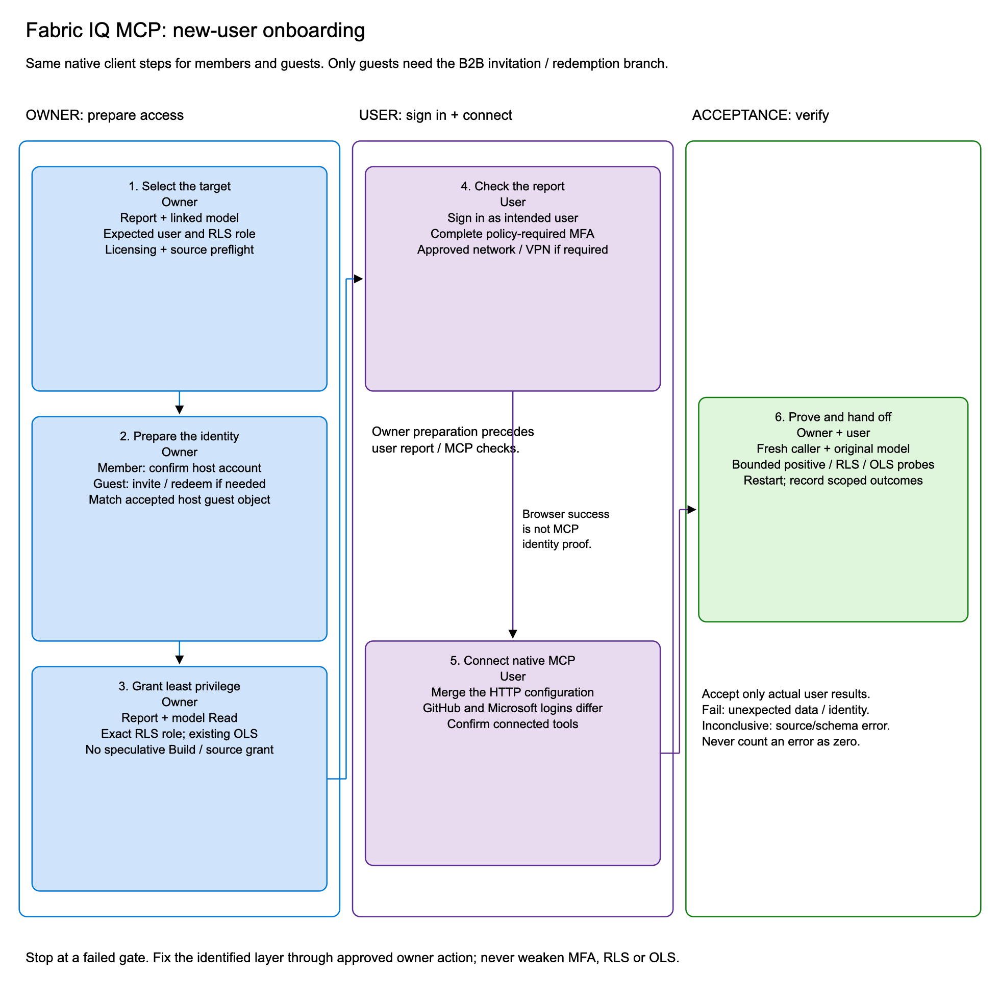

# Onboard a user

An authorized owner prepares access. The user signs in with their own account.
Do not use the owner's authentication to demonstrate the user's permissions.

For ordered steps, portal paths, and permission screenshots, use the
[B2B operating procedure](B2B-PROCEDURE.md). The checklist below is a shorter
companion, not a replacement for the security and licensing checks.

## Collect the target

Fill in the [environment worksheet](../examples/onboarding-inputs.example.json).
It is a planning template, not a configuration file consumed by an installer.
Replace placeholders; do not put credentials in it.

| Input | Owner supplies |
| --- | --- |
| Resource tenant | Directory hosting the Power BI content |
| User | Intended member or accepted guest; approved UPN aliases |
| Target | Report browser URL/ID and its linked semantic model |
| Licensing | Applicable viewer entitlement and model hosting requirements |
| Security | Intended RLS role, permitted data, denied tables/columns |
| Source | Owner-reviewed model credential mode and source permissions |
| Client | Platform, official CLI version, and configuration/profile location |

## Owner: prepare identity

### Tenant member

- [ ] Confirm the intended account exists and is enabled in the resource tenant.
- [ ] Confirm report/model access, licensing, and sign-in requirements.
- [ ] Assign the intended security role where RLS applies.

A member does not need a B2B invitation. The native connection and verification
steps below are otherwise the same.

### External B2B guest

- [ ] Check for an existing guest before sending another invitation.
- [ ] If needed, invite the external work/school account through approved Entra UI.
- [ ] Have the user redeem the invitation.
- [ ] Verify the accepted, enabled guest in the **resource tenant**.
- [ ] Match the correct host guest object; do not rely on display name alone.
- [ ] Check applicable cross-tenant, consent, MFA, and guest-sharing policies.

The guest uses their home account to authenticate. The host directory's guest
object is the access principal. The user does not need to administer their
home tenant.

## Owner: prepare least-privilege access

- [ ] Share the intended report read-only through supported Power BI UI.
- [ ] Verify semantic model Read access too; report sharing and model grants
      should not be assumed to be identical.
- [ ] Leave Build, Reshare, editor/workspace roles, and source access off unless
      independently required and approved for a different task.
- [ ] In the model's Security UI, assign the exact intended RLS role.
- [ ] Preserve existing memberships and avoid unintended additional roles.
- [ ] Confirm OLS-designated fields exist and are hidden for that role.
- [ ] Confirm the source configuration supports the intended query path.

Multiple RLS role memberships can broaden visible rows through additive role
behavior. Users with elevated workspace roles may not be restricted by RLS
in the same way as read-only consumers. Do not use an editor role for testing.

Use the model owner's policy, not another model's role definitions. The
[example RLS/OLS policy](B2B-PROCEDURE.md#example-rlsols-policy)
illustrates the separation between row restrictions and protected objects.

### Model source boundary

For a Direct Lake deployment with owner-approved fixed workspace identity
credentials and SSO disabled, the source authorizes that configured identity,
while Power BI must still enforce the guest's model permissions and RLS/OLS.
Configure and verify this at the model/source level, not for each new guest.

Other models use other credential modes. Do not turn off SSO, change a binding,
or grant a guest source access merely because a query fails.

## User: verify browser access

- [ ] Open the intended report browser URL, not a previous OAuth callback URL.
- [ ] Select the intended account and resource organization.
- [ ] Complete any required MFA registration/sign-in.
- [ ] If registration is restricted to approved network locations, connect
      through the organization's authorized network/VPN and retry.
- [ ] Confirm a permitted visual renders as this user.
- [ ] Report license prompts, visual errors, or unexpected data separately.

A report link can include `?ctid=<RESOURCE_TENANT_ID>` to select the hosting
directory. That selects browser context; it does not configure native MCP
OAuth or prove which identity executed a model query.

Do not disable Conditional Access, bypass MFA, or add unapproved network
exceptions. Browser success is useful but not a substitute for MCP proof.

## User: connect the native CLI

- [ ] Follow the [README setup](../README.md#copilot-cli-setup).
- [ ] Authenticate the CLI to GitHub if needed.
- [ ] Complete its separate native Microsoft sign-in as the intended user.
- [ ] Confirm `/mcp show FabricIQ` shows a connected server and available tools.
- [ ] Keep one live authorization flow; discard expired pages/callbacks.

The native CLI uses a preregistered Microsoft application. Its delegated
permissions are `Item.Read.All`, `Item.Execute.All`, and `Dataset.Read.All`
from the Power BI Service API. Consent follows tenant policy; escalate a
blocked approval to the appropriate resource-tenant owner, not a new app.

## Owner and user: accept the onboarding

- [ ] Fresh identity query returns the intended UPN/approved alias and actual model.
- [ ] A known permitted aggregate works.
- [ ] Owner-defined forbidden categories return no visible rows on each fact path.
- [ ] Denied tables return genuine zero counts, not errors disguised as zeros.
- [ ] Each confirmed protected column is omitted/rejected as expected.
- [ ] Restart the idle CLI and run a new identity query.
- [ ] Record pass/fail/inconclusive results, client version, target, and fresh markers.

See [verification](VERIFICATION.md) for bounded prompts.
Do not export raw logs, tokens, callback URLs, or customer records with the handoff.
